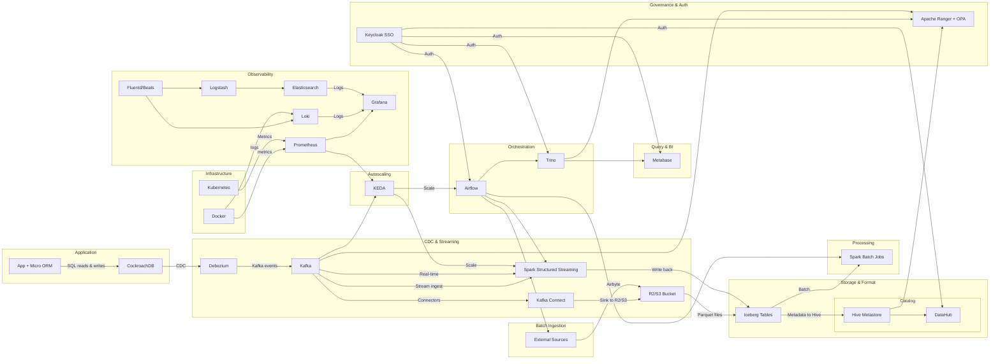

# Dataflow | Datalake

## Steps to Implementation

### 1. Application & ORM

- [ ] **Initialize Micro ORM** in your codebase
  - [x]Install the Micro ORM library
  - [ ] Define connection settings (host, port, user, password, database)
- [x] **Model your entities**
  - [x] Create entity classes for each table
  - [x] Annotate fields with types and constraints
- [ ] **Write and run migrations**
  - [ ] Scaffold initial schema migration
  - [ ] Apply migrations against your CockroachDB dev cluster
- [ ] **Implement basic CRUD flows**
  - [ ] Test create/read/update/delete operations end‑to‑end

### 2. OLTP Database (CockroachDB)

- [ ] **Provision a CockroachDB cluster**
  - [ ] Choose managed or self‑hosted
  - [ ] Configure node counts, regions, and high‑availability
- [ ] **Secure the cluster**
  - [ ] Enable TLS for client & node communications
  - [ ] Create admin & application users with least‑privilege roles
- [ ] **Create databases & schemas**
  - [ ] Set up your application database
  - [ ] Apply any namespace/schema partitioning you need
- [ ] **Load initial reference data** (optional)

### 3. Change‑Data‑Capture & Streaming

- [ ] **Provision Apache Kafka**
  - [ ] Deploy a multi‑broker cluster (with Zookeeper or KRaft)
  - [ ] Configure topics for each table/stream
- [ ] **Deploy Debezium connector**
  - [ ] Install Debezium plugin on Kafka Connect
  - [ ] Configure CockroachDB source connector (JDBC URL, slot name, whitelist tables)
- [ ] **Validate CDC events**
  - [ ] Produce test writes in CockroachDB
  - [ ] Consume from Kafka topics to verify schema & payload

### 4. Batch & Incremental Ingestion

- [ ] **Deploy Airbyte**
  - [ ] Stand up the Airbyte server & scheduler
  - [ ] Secure with API key / OAuth
- [ ] **Configure connectors**
  - [ ] Source connectors for each external system
  - [ ] Destination: your R2/S3 bucket
- [ ] **Schedule & test syncs**
  - [ ] Run an initial full sync
  - [ ] Validate Parquet files land in bucket

### 5. Object Store & Lakehouse Foundation

- [ ] **Provision R2/S3‑compatible bucket**
  - [ ] Create bucket, set lifecycle policies
  - [ ] Lock down IAM to only your services
- [ ] **Define Iceberg tables**
  - [ ] Initialize Iceberg catalog backed by Hive Metastore
  - [ ] Create table schemas pointing at Parquet prefix
- [ ] **Register Hive Metastore**
  - [ ] Stand up the HMS service
  - [ ] Grant “CREATE/TABLE” rights to Spark, Trino, etc.
- [ ] **Integrate DataHub**
  - [ ] Connect DataHub ingestion to the HMS
  - [ ] Verify datasets appear in DataHub UI

### 6. Batch & Streaming Processing (Spark)

- [ ] **Provision Spark cluster**
  - [ ] Decide standalone/YARN/K8s
  - [ ] Configure executors, memory, cores
- [ ] **Implement batch jobs**
  - [ ] Read from Iceberg tables, transform, write back
- [ ] **Implement Structured Streaming**
  - [ ] Consume from Kafka topics
  - [ ] Apply transformations, write to Iceberg
- [ ] **Test end‑to‑end**
  - [ ] Verify both batch and stream updates appear in Iceberg

### 7. Orchestration (Airflow)

- [ ] **Deploy Airflow**
  - [ ] Install webserver, scheduler, metadata DB
  - [ ] Secure with RBAC & Keycloak (OIDC)
- [ ] **Author DAGs**
  - [ ] Ingestion DAGs (Airbyte syncs, Debezium monitors)
  - [ ] Processing DAGs (Spark batch + stream jobs)
  - [ ] Query DAGs (Trino snapshot exports, if needed)
- [ ] **Set SLA & alerts**
  - [ ] Configure task failure notifications
  - [ ] Integrate with Slack / email

### 8. Interactive Query & BI

- [ ] **Deploy Trino**
  - [ ] Configure catalogs:
    - [ ] Iceberg (Hive Metastore)
    - [ ] CockroachDB
  - Tune memory & concurrency
- [ ] **Validate federated queries**
  - [ ] Query across Iceberg + CockroachDB in one SQL
- [ ] **Install Metabase**
  - [ ] Connect Metabase to your Trino endpoint
  - [ ] Create sample dashboards & charts
- [ ] **Set user permissions** via Keycloak SSO

### 9. Governance & Security

- [ ] **Deploy Apache Ranger + OPA plugin**
  - [ ] Integrate with Hive Metastore, Kafka, Trino
- [ ] **Define policies**
  - [ ] Column‑level masking, row‑level filtering, topic ACLs
- [ ] **Stand up Keycloak**
  - [ ] Configure realms, clients (Airflow, Metabase, Trino, DataHub)
  - [ ] Map roles → Ranger policies

### 10. Observability & Autoscaling

- [ ] **Metrics pipeline**
  - [ ] Deploy Prometheus → scrape CockroachDB, Kafka, Spark, Airflow
  - [ ] Stand up Grafana → import dashboards
- [ ] **Logging pipeline**
  - [ ] Deploy Fluentd/Beats → forward logs to Loki & Logstash
  - [ ] Deploy Elasticsearch & Kibana
  - [ ] Hook Loki + Elasticsearch as data sources in Grafana
- [ ] **Autoscaling with KEDA**
  - [ ] Install KEDA in your Kubernetes cluster
  - [ ] Create ScaledObjects monitoring Kafka lag & Prometheus metrics
  - [ ] Attach KEDA to Spark Streaming & Airflow workers
